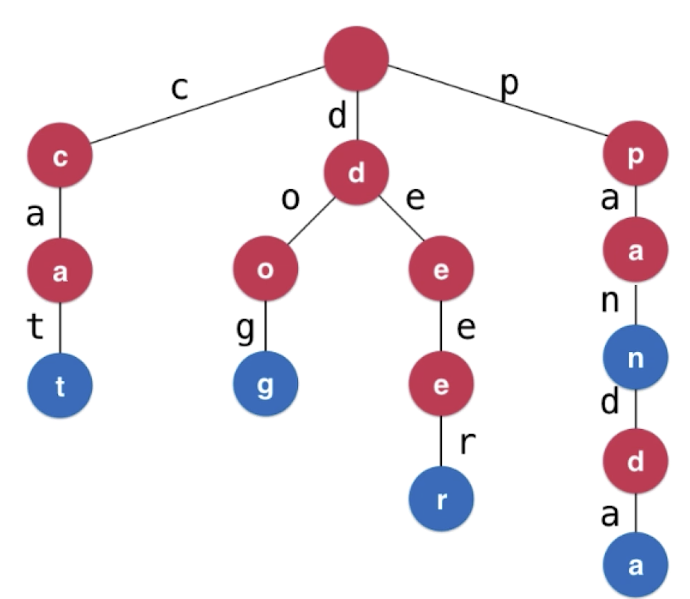

<!--
 * @Author: 27
 * @LastEditors: 27
 * @Date: 2020-05-20 21:57:11
 * @LastEditTime: 2020-05-20 23:25:07
 * @FilePath: /Algorithms_Note/content/数据结构与算法基础学习/Trie字典树/Trie.md
 * @description: type some description
--> 
## 字典树Trie

> 真实案例
当时微软在一个手持设备实现通讯录的功能，当时手持设备芯片运算能力很低，
所以就出现了一个问题，当通讯录条目非常低的时候，搜索通讯录中的内容是非常慢的，
当时被一个实习生解决，解决的办法就是用了字典树

多叉树， 通讯录

#### 对比字典和Trie

如果有n个条目
字典|Trie
:-:|:-:
使用树结构查询的复杂度是O(logN)|查询每个条目的时间复杂度与字典中一共有的条目的数量无关
如果有100万个条目，2^20,logN大约需要20次|时间复杂度为O(l)，l为条目的长度

所以从这样的情况来看，这个数据结构很适合用来查字典，因为绝大多数英文单词长度都并不是很长的。

从这个场景来看，如果只是为了查英文单词的字典，每个节点可以有26个指向下个节点的指针。
但是为了更通用，其实再设计数据结构类的时候可以不用对指向下个节点的指针数量做限制。我们每个节点有若干个指向下个节点指针即可。

节点的数据结构如下：
```
class Node:
    def __init__(self):
        self.is_word = False
        self.next = {}  # {char: Node}
```
字典树图示：


根据图可以知道实际上是这么一种结构：
```
self.root.next = {'c': Nodec , 'd': Noded, 'p': Nodep}
Nodec.next =  {'a' : Nonda}
```

### 实现字典树Trie
```
class Node:
    def __init__(self, is_word=False):
        self.is_word = is_word
        self.next = {}


class MyTrie:
    def __init__(self):
        """
        初始化方法，无需接收任何值
        根也是一个节点，且没有任何数据
        """
        self.root = Node()
        self.size = 0

    @property
    def get_size(self):
        """
        获取字典树的大小
        """
        return self.size

    def add_word(self, word):
        """
        接收一个字符串，但是需要把字符串拆成
        一个一个字符添加进字典树
        description: 向字典树中添加一个新的单词，word
        """
        # 先让curr指向当前根节点
        curr = self.root
        for char in word:
            # 先检查下一个节点有没有这个字符
            next_node = curr.next.get(char, None)
            # 如果没有则用这个字符生成一个新节点
            if next_node is None:
                next_node = Node()
                curr.next = {char: next_node}
            # 如果有就把curr移动到下一个，然后进入下一循环
            curr = next_node
        # 这个单词之前没有存进来过，那这个值不会是true
        if not curr.is_word:
            curr.is_word = True
            # 这时才能确认我们添加的是一个新的单词，才把size+1
            self.size += 1

    def contains_word(self, word):
        """
        查看单词word是否在trie中
        """
        # 把root找出来
        curr = self.root
        # 遍历word的每个字符
        for char in word:
            # 检查下一个节点有没有这个字符串
            next_node = curr.next.get(char, None)
            if next_node is None:
                return False
            else:
                curr = next_node
        # 这时不能return true，原因比如我们查pan，但是字典里已经有panda了，
        # 所以我们还要判断这个节点的is_word是不是true，是true的话才能返回true
        # 所以直接返回is_word的值即可
        return curr.is_word

    def is_prefix(self, prefix):
        """
        description: 判断trie中是否有一prefix为前缀的单词，定义一个单词的本身也是其前缀。
        :param prefix: 前缀字符串
        :return: bool, true or false
        """
        curr = self.root
        for char in prefix:
            if char not in curr.next:
                return False
            else:
                curr = curr.next[char]
        # 这个无需看标识，不管遍历完prefix是不是单词的结尾都可以说trie中有以prefix为前缀的单词
        return True


"""
leetcode 208 ， 自己实现前缀树~~~~可以去做一下
"""
```
[实现Trie源代码](./my_trie.py)

